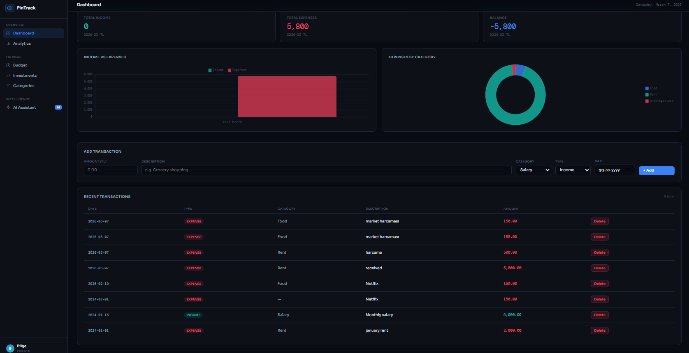
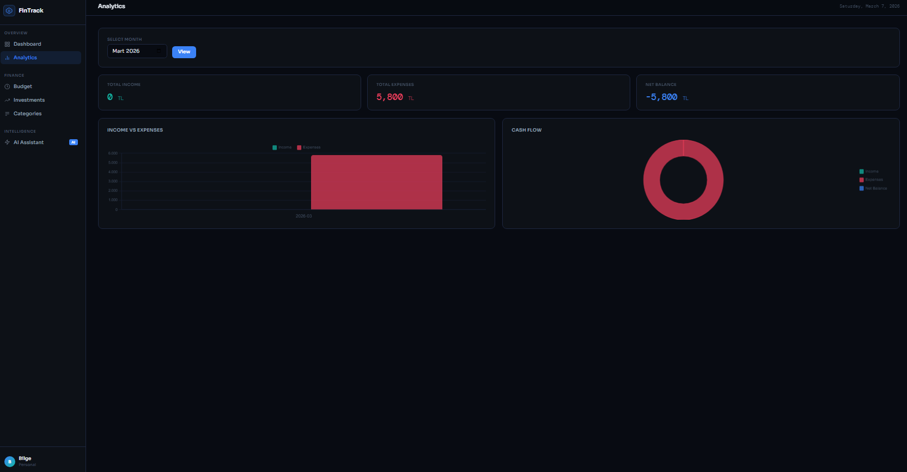
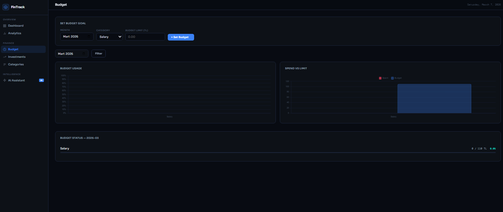
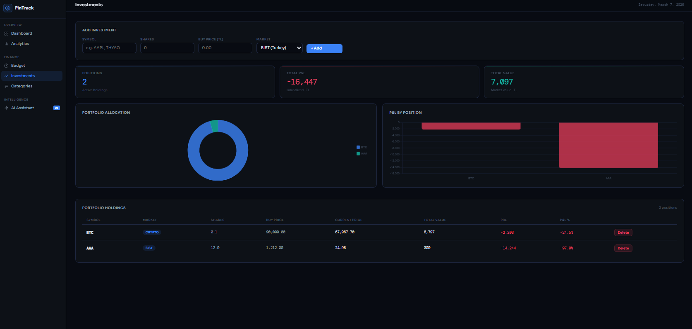
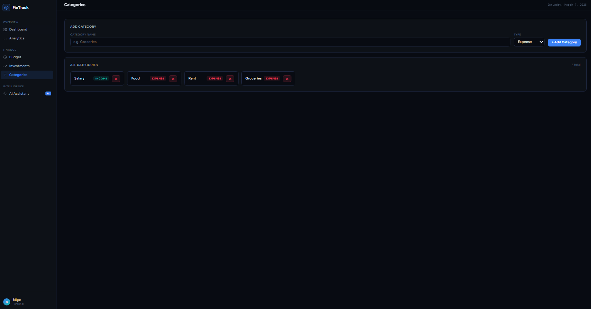
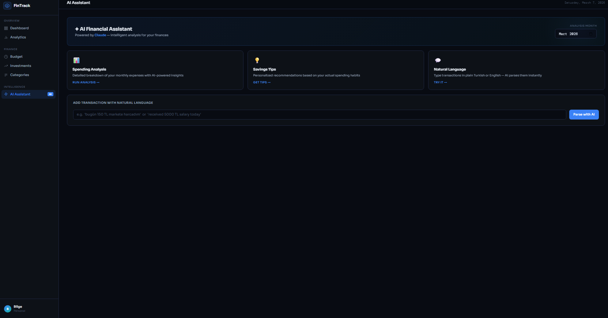
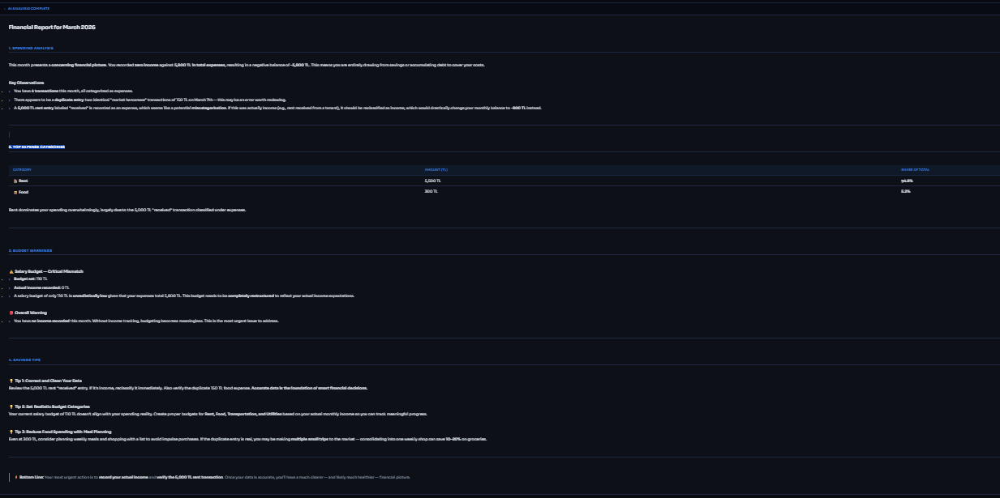
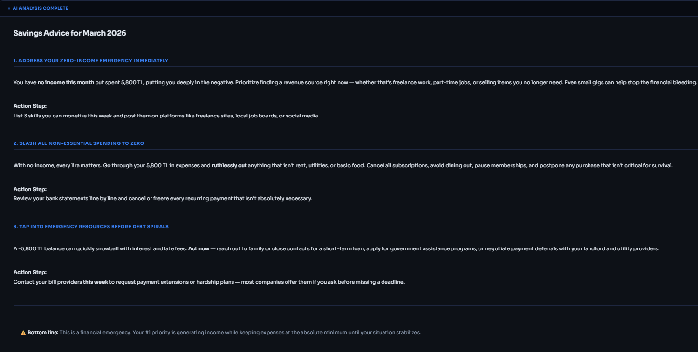

# 💰 FinTrack

> A full-stack personal finance management application with a professional dark SaaS dashboard, AI-powered insights, and real-time investment tracking.


---

## 📋 Table of Contents

- [Overview](#overview)
- [Screenshots](#screenshots)
- [Features](#features)
- [Project Structure](#project-structure)
- [Installation](#installation)
- [Usage](#usage)
- [Tech Stack](#tech-stack)
- [Roadmap](#roadmap)

---

## 🔍 Overview

FinTrack is a personal finance application that helps you manage income, expenses, budgets, and investments in one place. It features a professional dark-themed SaaS dashboard with interactive Chart.js visualizations and an AI assistant powered by the Claude API for spending analysis, savings tips, and natural language transaction parsing.

---

## 📸 Screenshots

### Dashboard


### Analytics


### Budget


### Investments


### Categories


### AI Assistant


### AI Spending Analysis


### AI Savings Tips


---

## ✨ Features

| Feature | Description |
|---|---|
| 💸 Transactions | Add, edit, delete income & expense records |
| 🗂️ Categories | Organize transactions by custom categories |
| 🎯 Budget Goals | Set monthly spending limits with progress tracking |
| 📊 Charts | Interactive Chart.js visualizations across all pages |
| 📈 Investments | Track BIST, NYSE/NASDAQ and crypto portfolios in real-time |
| 🤖 AI Assistant | Claude-powered spending analysis, savings tips & natural language input |
| 💬 Natural Language | Add transactions by typing plain text ("spent 150 TL on groceries") |
| 🌐 Web Dashboard | Professional dark SaaS interface with Sora typography |

---

## 📁 Project Structure

```
finance-tracker/
├── data/
│   └── finance.db
├── screenshots/
│   ├── dashboard.png
│   ├── analytics.png
│   ├── budget.png
│   ├── investments.png
│   ├── categories.png
│   ├── ai-assistant.png
│   ├── ai-analysis.png
│   └── ai-savings.png
├── src/
│   ├── models/
│   │   ├── database.py
│   │   ├── category.py
│   │   ├── transaction.py
│   │   └── budget.py
│   ├── services/
│   │   ├── transaction_service.py
│   │   ├── budget_service.py
│   │   ├── recurring_service.py
│   │   └── ai_service.py
│   ├── reports/
│   │   └── charts.py
│   └── investments/
│       └── stock_tracker.py
├── web/
│   ├── templates/
│   │   ├── base.html
│   │   ├── index.html
│   │   ├── summary.html
│   │   ├── budget.html
│   │   ├── investments.html
│   │   ├── categories.html
│   │   └── ai.html
│   ├── static/
│   │   ├── css/style.css
│   │   └── js/main.js
│   ├── __init__.py
│   └── routes.py
├── app.py
├── main.py
├── config.py
├── requirements.txt
└── README.md
```

---

## ⚙️ Installation

**1. Clone the repository**
```bash
git clone https://github.com/bilgenurpala/finance-tracker.git
cd finance-tracker
```

**2. Install dependencies**
```bash
py -m pip install -r requirements.txt
```

**3. Configure API key**

Create a `config.py` file in the root directory:
```python
import os

BASE_DIR = os.path.dirname(os.path.abspath(__file__))
DATABASE_PATH = os.path.join(BASE_DIR, "data", "finance.db")
CURRENCY = "TL"
ANTHROPIC_API_KEY = "your-api-key-here"  # Get from console.anthropic.com
```

**4a. Run the web application**
```bash
py app.py
```
Then open http://127.0.0.1:5000 in your browser.

**4b. Run the terminal application**
```bash
py main.py
```

---

## 🚀 Usage

### Web Dashboard
After launching `app.py`, navigate to `http://127.0.0.1:5000` and use the sidebar to access all features:

- **Dashboard** — Monthly stats, income vs expense chart, category breakdown
- **Analytics** — Monthly summary with interactive charts
- **Budget** — Set and track budget goals with progress bars and charts
- **Investments** — Add and track BIST, NYSE/NASDAQ, and crypto portfolios with P&L charts
- **Categories** — Manage income and expense categories
- **AI Assistant** — Claude-powered spending analysis, savings tips, and natural language transaction input

### AI Assistant
Navigate to `/ai` to use AI features:
- **Spending Analysis** — Detailed monthly breakdown with insights
- **Savings Tips** — Personalized recommendations based on your data
- **Natural Language Input** — Type transactions in plain text:
  - `"spent 200 TL on groceries today"`
  - `"received 5000 TL salary"`

### Terminal App
After launching `main.py`, use the numbered menu to access all features including transactions, budgets, investments, and charts.

---

## 🛠️ Tech Stack

| Tool | Purpose |
|---|---|
| Python 3.12 | Core language |
| Flask | Web framework |
| SQLite | Local database |
| Jinja2 | HTML templating |
| Chart.js | Interactive charts |
| Claude API | AI spending analysis & NLP |
| Anthropic SDK | Claude API client |
| yfinance | Real-time stock & crypto prices |
| Rich | Terminal UI |
| Matplotlib | Terminal charts |

---

## 🗺️ Roadmap

- [x] Terminal application
- [x] Flask web interface
- [x] Professional dark SaaS dashboard
- [x] Interactive Chart.js visualizations
- [x] Real-time investment tracking with P&L
- [x] AI-powered spending analysis (Claude API)
- [x] Natural language transaction input
- [ ] User authentication (JWT)
- [ ] Landing page
- [ ] Multi-currency support
- [ ] Export to CSV/PDF

---

## 📄 License

This project is licensed under the MIT License.