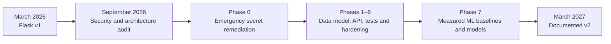
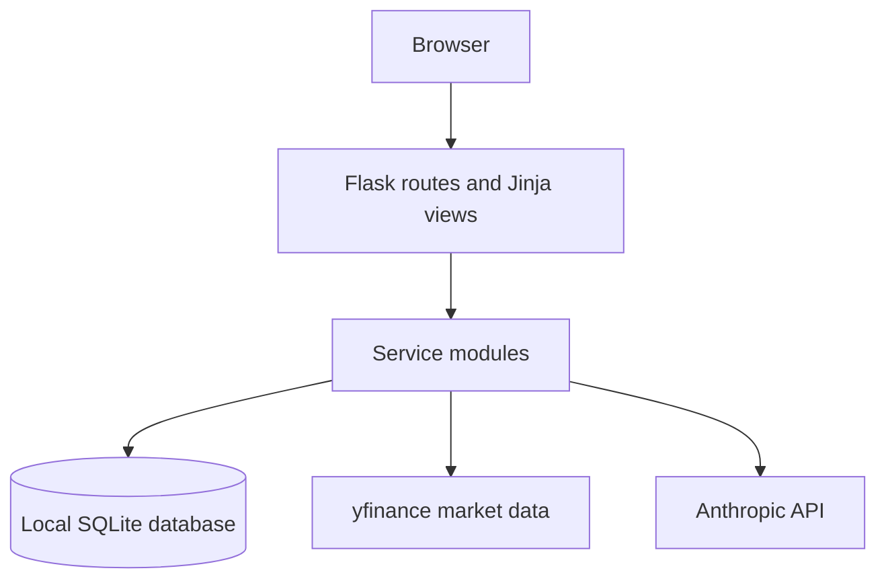
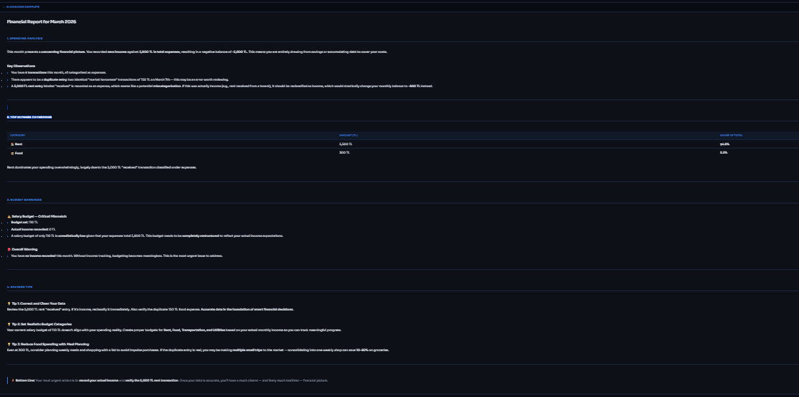
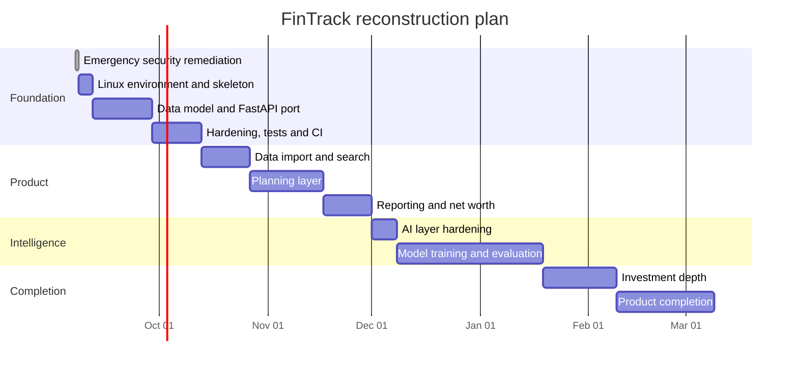

# FinTrack

FinTrack is a personal finance application and a six-month engineering case study in rebuilding an early Flask project into a secure, tested, production-oriented system.

The repository deliberately preserves the March 2026 interface and selected audit evidence. The purpose is not to present the first version as finished software, but to document how its architecture, security model, and product depth evolve under a structured review.

> [!IMPORTANT]
> FinTrack is under active reconstruction. The current Flask version is a historical baseline, not a production-ready financial system. Do not use it to store real financial data yet.

## Project status

| Item | Current state |
|---|---|
| Active phase | Phase A complete: environment, quality gates and first tests in place. Phase 1 next: data model and FastAPI port |
| Current application | Flask, SQLite, server-rendered Jinja; FastAPI skeleton on port 8000 with a config layer, async database and cache connections, and a health endpoint |
| Target application | FastAPI, PostgreSQL, async SQLAlchemy, Alembic |
| Security posture | Exposed secrets removed and rotated, history rewrite independently verified, v1 repository archived as private; structural authorization and web-security findings remain open |
| Test coverage | 12 tests covering the health endpoint and settings validation; 81 percent of app/. Each gate verified against a deliberately broken input |
| Intended use | Personal engineering portfolio and learning record |
| Production readiness | Not production ready |


```mermaid
flowchart LR
    V1["March 2026<br/>Flask v1"] --> Audit["September 2026<br/>Security and architecture audit"]
    Audit --> P0["Phase 0<br/>Emergency secret remediation"]
    P0 --> Rebuild["Phases 1–6<br/>Data model, API, tests and hardening"]
    Rebuild --> ML["Phase 7<br/>Measured ML baselines and models"]
    ML --> V2["March 2027<br/>Documented v2"]
```

## Why this repository exists

The first version was written before authentication, ownership, migrations, and defensive LLM output handling were understood as system-wide design concerns. A September 2026 audit found that these were not isolated bugs; they were consequences of implementation order and missing architectural boundaries.

This rebuild keeps that evidence visible. Each phase records:

- what the earlier implementation did;
- which assumption failed;
- how the design changed;
- how the new behavior was verified.

The tone is an audit record rather than a retrospective apology. Claims are tied to code, tests, or preserved evidence.

## Phase 0 security remediation

| Control | Result |
|---|---|
| Leaked provider credential | Revoked and replaced |
| JWT signing secret | Replaced with a generated local secret |
| Git history | Rewritten to remove compiled configuration and personal database artifacts |
| Remote verification | Raw object scan of a fresh mirror clone found no target paths or content markers |
| Verification method | Validated with a negative control against the pre-cleanup backup, independently of Gitleaks |
| Residual server-side objects | Pre-rewrite commits remained retrievable by SHA; the v1 repository was archived as private and development moved to a new repository |
| Local configuration | Migrated from an ignored Python module to `.env`; typed settings loading arrives with the FastAPI skeleton |
| Commit guard | Gitleaks pre-commit hook pinned to a reviewed version; its default ruleset does not match the provider key format involved, so a custom rule is scheduled for Phase 2 |
| Repository hygiene | Database files, virtual environments, caches, and `.env` ignored |
| Licensing | MIT license file added |

The audit also identified unresolved application-level risks, including missing per-user ownership in financial tables, unsafe state-changing GET routes, disabled cookie CSRF protection, indefinite access tokens, and unsafe rendering of model output. These are tracked work, not closed findings. See [Security](docs/SECURITY.md) and the [sanitized v1 evidence](docs/evidence/v1-code-snippets.md).

## Current architecture


```mermaid
flowchart TB
    Browser[Browser] --> Views[Flask routes and Jinja views]
    Views --> Services[Service modules]
    Services --> SQLite[(Local SQLite database)]
    Services --> Markets[yfinance market data]
    Services --> Claude[Anthropic API]
```

The current system is intentionally retained only as the v1 baseline. Its central limitation is that authentication exists at the route layer while ownership is absent from the underlying financial schema. The target design is documented in [Architecture](docs/ARCHITECTURE.md).

## V1 interface archive

These screenshots preserve the March 2026 interface before the rebuild. They document the starting point and are not representations of the target product.

| Dashboard | Analytics |
|---|---|
|  |  |

| Budgets | Investments |
|---|---|
|  |  |

| Categories | AI assistant |
|---|---|
|  |  |

| AI spending analysis | AI savings guidance |
|---|---|
|  |  |

## Current capabilities

The retained Flask baseline includes:

- income and expense entry;
- category and monthly budget management;
- monthly summaries and Chart.js visualizations;
- investment position tracking through market-data lookups;
- JWT cookie authentication;
- Claude-powered monthly analysis, savings guidance, and natural-language transaction parsing;
- a Rich-based terminal interface inherited from the first implementation.

These features describe surface area, not security guarantees. Known limitations are documented openly and take precedence over feature claims.

## Technology direction

| Layer | V1 baseline | Target |
|---|---|---|
| Web framework | Flask | FastAPI and Uvicorn |
| Rendering | Jinja templates | Server-rendered Jinja templates |
| Persistence | Raw `sqlite3` and SQLite | SQLAlchemy 2.0 async, Alembic, PostgreSQL |
| Validation | Ad hoc request handling | Pydantic v2 schemas |
| Authentication | Flask-JWT-Extended cookies | PyJWT cookies, bounded sessions, explicit revocation |
| Background work | Request-driven logic | APScheduler and Redis-backed coordination |
| AI integration | Direct Anthropic messages | Structured, bounded, evaluated model workflows |
| Verification | Manual checks | pytest-asyncio, HTTPX, security regression tests, CI |
| Delivery | Local development server | Docker Compose and production ASGI serving |

## Running the historical baseline

The current application is retained for audit and migration work. Use synthetic data only.

### Requirements

- Git
- Python 3.12
- `uv` or another isolated Python environment tool

### Setup

```bash
git clone https://github.com/bilgenurpala/finance-tracker.git
cd finance-tracker

uv venv --python 3.12 .venv
source .venv/bin/activate
uv pip install -r requirements.txt

cp .env.example .env
python -c "import secrets; print(secrets.token_urlsafe(64))"
```

Copy the generated value into `SECRET_KEY` in `.env`. Add an Anthropic API key only if the AI routes are being tested. Never commit `.env`.

```dotenv
SECRET_KEY=replace_with_generated_value
ANTHROPIC_API_KEY=
DATABASE_PATH=data/finance.db
```

Start the development application:

```bash
python app.py
```

Then open `http://127.0.0.1:5000`. The current entry point enables Flask debug mode and must not be exposed to an untrusted network.

## Local service dependencies

PostgreSQL and Redis run as containers and back the target architecture. The
historical Flask baseline above does not use them.

```bash
cp .env.example .env
docker compose up -d
docker compose ps
```

Both services must report `healthy`. Credentials are read from `.env` and are
never written into `docker-compose.yml`.

Published ports bind to `127.0.0.1`, not `0.0.0.0`. This matters because Docker
installs its own iptables rules ahead of the host firewall, so a port published
to all interfaces stays reachable from the local network even with `ufw`
enabled.

Named volumes hold the data, so `docker compose down` removes the containers
without discarding the databases.

## Repository map

```text
finance-tracker/
├── app.py                     # Flask entry point retained for v1
├── settings.py                # Environment-backed configuration
├── src/
│   ├── models/                # Raw SQLite access and schema creation
│   ├── services/              # Finance, authentication, and AI logic
│   ├── investments/           # Market-data integration
│   └── reports/               # Legacy chart generation
├── web/
│   ├── templates/             # Server-rendered pages
│   └── static/                # CSS, JavaScript, and retained v1 assets
├── docs/
│   ├── evidence/              # Sanitized audit evidence
│   └── screenshots/v1/        # Archived March 2026 interface
├── .env.example
├── .pre-commit-config.yaml
├── docker-compose.yml         # PostgreSQL and Redis for the target stack
└── requirements.txt
```

## Roadmap


```mermaid
gantt
    title FinTrack reconstruction plan
    dateFormat  YYYY-MM-DD
    axisFormat  %b %d
    section Foundation
    Emergency security remediation :done, p0, 2026-09-07, 1d
    Linux environment and skeleton  :pA, 2026-09-08, 4d
    Data model and FastAPI port      :p1, 2026-09-12, 17d
    Hardening, tests and CI          :p2, 2026-09-29, 14d
    section Product
    Data import and search           :p3, 2026-10-13, 14d
    Planning layer                   :p4, 2026-10-27, 21d
    Reporting and net worth          :p5, 2026-11-17, 14d
    section Intelligence
    AI layer hardening               :p6, 2026-12-01, 7d
    Model training and evaluation    :p7, 2026-12-08, 42d
    section Completion
    Investment depth                 :p8, 2027-01-19, 21d
    Product completion               :p9, 2027-02-09, 28d
```

Detailed scope and exit criteria are maintained in [Roadmap](docs/ROADMAP.md).

## Documentation

| Document | Purpose |
|---|---|
| [Architecture](docs/ARCHITECTURE.md) | Current constraints, target boundaries, and migration principles |
| [Security](docs/SECURITY.md) | Audit scope, remediated exposure, open findings, and reporting policy |
| [Roadmap](docs/ROADMAP.md) | Phase sequence, deliverables, and exit criteria |
| [Design system](docs/design-system.md) | Visual tokens, semantics, accessibility, and frontend safety rules |
| [V1 code evidence](docs/evidence/v1-code-snippets.md) | Sanitized excerpts captured before history cleanup |
| [Secret scan notes](docs/evidence/secret-scan-notes.md) | Scanner limitations and independent validation |

## License

FinTrack is available under the [MIT License](LICENSE).
