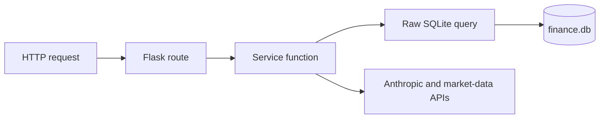
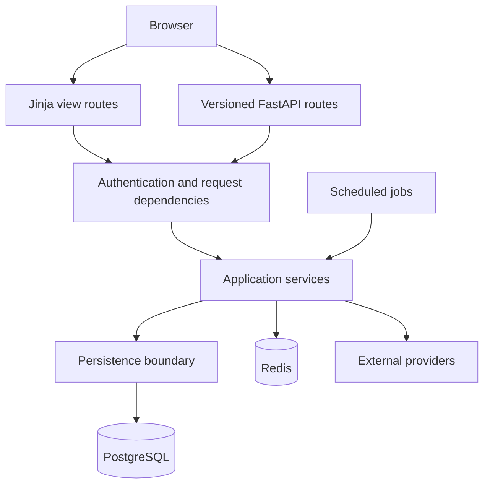

# Architecture

## Status

This document separates the retained Flask baseline from the target architecture. The target is planned, not yet implemented; decisions will be revised as migrations and tests produce evidence.

## Current constraints



The v1 application has several structural constraints:

- authentication exists at the route layer, while financial tables lack ownership fields;
- money is represented with floating-point values;
- schema creation is distributed and has no migration history;
- external calls are coupled directly to application services;
- the terminal and web interfaces share internals without an explicit application boundary.

## Target structure

```text
app/
├── main.py
├── core/          # configuration, security, dependencies
├── db/models/     # SQLAlchemy models
├── schemas/       # Pydantic request and response contracts
├── api/v1/        # versioned API routes
├── views/         # server-rendered page routes
├── services/
├── templates/
└── static/
alembic/
tests/
ml/
docs/
```



## Design principles

1. Ownership is a schema invariant: user-scoped entities carry `user_id`, and every operation is scoped by the authenticated principal.
2. Money is exact: amounts use minor units or a constrained decimal representation.
3. Schema changes are migrations; runtime services never create tables.
4. Views and APIs share application services, not request objects or SQL fragments.
5. Provider clients have timeouts, retries, validation, and cost tracking.
6. Security properties receive regression tests, including isolation, IDOR, CSRF, and unsafe output handling.
7. Server-rendered HTML remains the default; the product does not require a SPA.

FastAPI is introduced with the ownership-aware data model so the new transport layer is not built on the old authorization model. See [Roadmap](ROADMAP.md) for phase boundaries.
