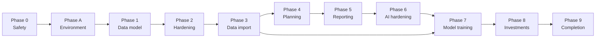

# Roadmap

Phase completion is determined by exit criteria, not dates alone. Planning assumes approximately ten focused hours per week alongside study and internship commitments.

| Phase | Planned window | Focus | Exit criterion |
|---|---|---|---|
| 0 | 7 Sep 2026 | Emergency repository security | History scans clean, secrets are environment-backed, evidence is preserved |
| A | 8–11 Sep 2026 | Linux environment and skeleton | Reproducible Python, Docker, PostgreSQL, Redis, and FastAPI structure |
| 1 | 12–28 Sep 2026 | Ownership-aware model and FastAPI port | Automated test proves isolation between two users |
| 2 | 29 Sep–12 Oct 2026 | Hardening, tests, CI, deployment baseline | CI passes and Docker Compose starts from zero |
| 3 | 13–26 Oct 2026 | Statement import, search, rules, export | A real statement with more than 500 transactions imports safely |
| 4 | 27 Oct–16 Nov 2026 | Recurrence, budgets, goals, cash-flow planning | The next 60 days of deterministic cash flow calculate correctly |
| 5 | 17–30 Nov 2026 | Reporting and net worth | Verified twelve-month savings-rate and net-worth views |
| 6 | 1–7 Dec 2026 | LLM safety, structure, caching, evaluation | Analysis is cached and model output renders safely |
| 7 | 8 Dec 2026–18 Jan 2027 | Data pipeline and measured ML | Classifier beats a documented baseline on a real held-out set |
| 8 | 19 Jan–8 Feb 2027 | Investment accounting and coverage | Returns separate realized, unrealized, fee, tax, and FX effects |
| 9 | 9 Feb–8 Mar 2027 | Product completion and delivery | Production deployment, complete docs, and v2 visual archive |

Phase 3 is a hard prerequisite for meaningful model training: the evaluation set must contain real, manually reviewed transaction descriptions. Synthetic data may augment training, never replace the real test set.

## Documentation checkpoints

- Phase 0: v1 evidence, repository status, and documentation skeleton.
- Phase A: verified local setup instructions.
- Phase 1: architecture and migration decisions.
- Phase 2: full security report, OWASP mapping, and before/after narrative.
- Phases 3–5 and 8: product change log after each phase.
- Phase 7: data card, evaluation report, and model card.
- Phase 9: v2 screenshots and final visual comparison.
